<picture>
  <source media="(prefers-color-scheme: dark)" srcset="./assets/dark.svg">
  <source media="(prefers-color-scheme: light)" srcset="./assets/light.svg">
  
</picture>

 

 

## 🧭 About

I'm a full-stack developer who enjoys the messy middle of building things — the part where a good idea turns into a working, polished product. I care as much about how an interface *feels* as how the code behind it *runs*, and I'm always experimenting with something new on the frontend.

- 🎓 B.Tech student at **Guru Nanak Institute of Technology**
- 🔭 Currently deep in **React**, **Next.js**, and building full-stack apps with **Node.js** + **MongoDB**
- 🌱 Exploring backend architecture, animation-heavy UI, and 3D-on-the-web
- ⚡ Fun fact: I'd rather fix a 1px alignment issue than ship it broken

 

## 🧰 Tech Arsenal

**Frontend**

**Backend & Data**

**Languages**

**Tools & Platforms**

 

## 🐍 My Contributions, One Byte at a Time

<picture>
  <source media="(prefers-color-scheme: dark)" srcset="https://raw.githubusercontent.com/S-o-b-u/S-o-b-u/output/github-contribution-grid-snake-dark.svg">
  <source media="(prefers-color-scheme: light)" srcset="https://raw.githubusercontent.com/S-o-b-u/S-o-b-u/output/github-contribution-grid-snake.svg">
  
</picture>

a snake, powered by GitHub Actions, eating its way through my commit history — set-up steps below ⬇️

 

## 📊 GitHub Analytics

<!-- <table>
<tr>
<td></td>
<td></td>
</tr>
</table> -->

 

## ✍️ Random Dev Wisdom

 

## 🤝 Let's Build Something

 

